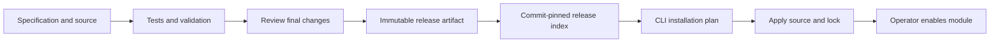

<p align="center">
  
</p>

<p align="center">
  <a href="https://github.com/Flowdular/flowdular">Platform</a> ·
  <a href="CONTRIBUTING.md">Contribute</a> ·
  <a href="registry/index.json">Release index</a> ·
  <a href="LICENSE">MIT license</a>
</p>

# Business modules for Flowdular

Install the modules your business needs, keep their source in your workspace, and adapt them through the same contracts used by the platform.

This repository owns the official business modules and their versioned source releases. [Flowdular core](https://github.com/Flowdular/flowdular) owns authentication, the runtime, shared UI, agents, sandbox and CLI. The [website](https://github.com/Flowdular/landing) lives separately.

> **Compatibility:** this repository uses the published `@flowdular/sdk@0.1.0` and `flowdular@0.1.0`. All three modules currently declare experimental stability and platform API `0.1.0`.

## Available modules

| Module   | ID              | Version | Source                                            |
| -------- | --------------- | ------- | ------------------------------------------------- |
| Expenses | `expenses.core` | `0.6.1` | [Expense records and workflows](modules/expenses) |
| Parties  | `parties.core`  | `0.8.1` | [Business party records](modules/parties)         |
| Catalog  | `catalog.core`  | `0.6.1` | [Catalog records](modules/catalog)                |

Each module includes its specification, server and client code, English and Polish translations, migrations and tests. The existing `.core` IDs are preserved for compatibility; they do not mean the source must remain in the core repository.

## Install into your workspace

Run these commands from a Flowdular workspace:

```sh
pnpm flowdular module search
pnpm flowdular module info expenses.core

# Inspect the installation plan, then write the reviewed source.
pnpm flowdular module install expenses.core@0.6.1
pnpm flowdular module install expenses.core@0.6.1 --apply

# Compose the installed module into your application.
pnpm flowdular module enable expenses.core --apply
pnpm flowdular module validate --locked
```

Installation resolves compatible module dependencies and records source hashes in a lock file. It writes source only. Enablement is a separate operator action; apply your application's scope grants and migration procedure before use.

```sh
# Preview an update before applying it.
pnpm flowdular module update expenses.core
pnpm flowdular module update expenses.core --apply

# Inspect an interrupted installation before recovery.
pnpm flowdular module recover
```

Updates reject local source edits, changes to historical migrations and downgrades. Keep intentional customizations under version control and reconcile them before updating. The installer does not merge local changes automatically.

## From contribution to installed source



Release artifacts contain bounded, allowlisted files and SHA-256 digests. The packer rejects stale review evidence and refuses to replace different content at an existing version. Remote artifact URLs point to an exact commit in this repository. Installation verifies the artifact and its source files before writing them.

These checks catch compatibility failures, accidental changes and stale evidence. Review records are not signatures or proof that code is bug-free. Publishing access and human review remain part of the trust model.

## Repository layout

```text
modules/                 Editable module source and specifications
reviews/                 Source-bound review evidence for each module
registry/index.json      Official release catalog consumed by the CLI
registry/releases/       Immutable, versioned source artifacts
scripts/build-release.mjs Release packaging and index generation
platform/                Validation baseline for core dependencies
tests/consumer/         Cross-module integration tests
docs/                   Review notes and repository artwork
```

## Work on a module

Use Node.js 24 and the pnpm version declared in `package.json`.

```sh
pnpm install
pnpm verify
```

Read [CONTRIBUTING.md](CONTRIBUTING.md) for specifications, tests, review evidence and release steps. New modules start with an approved specification. Existing modules need tests that demonstrate their changed behavior and preserve public contracts.

Dependencies resolve from npm through the committed `pnpm-lock.yaml`. CI installs with `pnpm install --frozen-lockfile` in both jobs. Keep temporary local tarball overrides out of commits.

CI runs module validation and tests, PostgreSQL tests with restricted runtime roles, and a fresh application integration job. The application job installs every module from the PR, typechecks and tests the combined app, builds its client and server, then checks the running server over HTTP. See the [initial transfer review](docs/reviews/initial-transfer.md) for the extraction evidence.

## License

[MIT](LICENSE). Module source remains available in the installed workspace.

The npm surface is three packages: `@flowdular/sdk`, `flowdular` and `create-flowdular`. Modules here depend on the SDK; UI comes from `@flowdular/sdk/ui`. Module releases before the shared SDK transition remain in history; use the current versions listed above.

## Agent-assisted contributions

The [contributor skills](.ai/skills/README.md) cover specification, implementation, tests, review and pull requests. RuleSync keeps Codex and Claude Code instructions synchronized; see [CONTRIBUTING.md](CONTRIBUTING.md).
